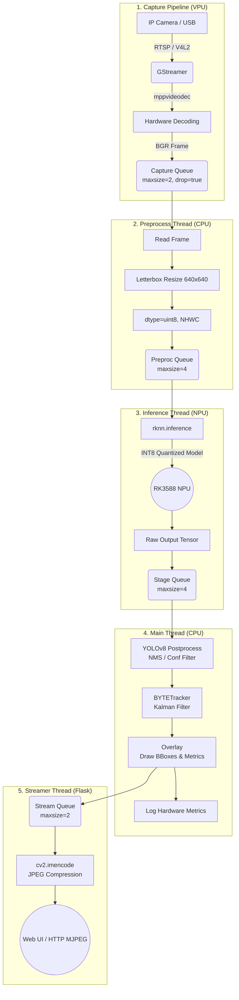

# Edge AI Workshop - RKNN Pipeline (RK3588)

Bu proje, Rockchip **RK3588** (Firefly vb. SBC'ler) üzerinde gerçek zamanlı, düşük gecikmeli (low-latency) yapay zeka çıkarımı ve nesne takibi (object tracking) yapmak için tasarlanmış uçtan uca (end-to-end) bir Edge AI uygulamasıdır. 

Sistem, CPU darboğazlarını aşmak için asenkron iş parçacıkları (multithreading), donanımsal video çözücüler (VPU) ve NPU hızlandırması (RKNN INT8) kullanılarak yüksek FPS hedefine ulaşacak şekilde optimize edilmiştir.

---

## 🏗️ Uçtan Uca Mimari (End-to-End Pipeline)

Uygulamanın ana akışı, her biri birbirinden bağımsız ve asenkron çalışan 5 farklı birimden (Thread/Süreç) oluşur. Bu mimari sayesinde, kameradan görüntü alınırken yapay zeka işlemcisinin (NPU) boşta beklemesi engellenir.



---

## ⚙️ Pipeline Katmanlarının Detayları

### 1. Capture Thread (Görüntü Alma & Decode)
Sistemin gözüdür. RTSP IP Kameralarından veya yerel USB kameralardan görüntüyü alır.
- **Donanım Hızlandırması:** IP Kameralardan gelen sıkıştırılmış H.264/H.265 akışları CPU'da çözülmez. GStreamer içindeki **`uridecodebin`** ve **`mppvideodec`** (Rockchip Media Process Platform) kullanılarak doğrudan VPU'da (Video Processing Unit) donanımsal olarak çözülür.
- **Sıfır Gecikme (Zero-Latency) Mantığı:** `appsink max-buffers=2 drop=true` özelliği sayesinde, eğer yapay zeka bir anlığına yavaşlarsa, eski kareler çöpe atılır ve daima **en taze kare (latest frame)** işlenir.

### 2. Preprocess Thread (Ön İşleme)
Yapay zeka modelinin beklediği matematiksel formata hazırlık aşamasıdır.
- Kameradan gelen örneğin 1920x1080 boyutlarındaki BGR görüntü, modelin girdi boyutu olan `640x640` formatına **Letterbox** mantığıyla (en-boy oranını bozmadan, boşlukları siyaha boyayarak) küçültülür.
- RKNN INT8 modelleri veriyi genellikle doğrudan `uint8` olarak kabul ettiği için ağır `float32` dönüşümlerine gerek kalmaz.

### 3. Inference Thread (NPU & RKNN)
Projenin beynidir ve yapay zeka çıkarımının yapıldığı yerdir.
- **Model:** `yolov8n_int8.rknn` (YOLOv8 Nano, 8-bit Quantized).
- **Donanım:** RK3588'in 6 TOPS gücündeki NPU'su kullanılır. NPU, FP32 veya FP16 veriler yerine **INT8 (8-bit tam sayı)** ağırlıkları kullandığı için bant genişliğinden (RAM bandwidth) büyük tasarruf sağlar ve çıkarım süresi ~10-15 milisaniyelere kadar düşer.

### 4. Main Thread (Postprocess & Tracking)
Modelin ürettiği milyonlarca ham sayının insan tarafından anlaşılır verilere dönüştürüldüğü aşamadır.
- **Postprocess (NMS):** YOLOv8'den gelen çoklu ve üst üste binmiş kutular "Non-Maximum Suppression (NMS)" algoritması ile elenir.
- **Tracking (BYTETracker):** Sadece nesneyi tespit etmekle kalmaz, **Kalman Filtresi** ve IoU eşleştirmesi kullanarak nesnelere benzersiz ID'ler (`Track ID: 5`) atar ve hareketlerini videodaki ardışık kareler boyunca takip eder.
- **Overlay:** Belirlenen koordinatlara renkli dikdörtgenler, ID'ler ve FPS/NPU donanım istatistikleri OpenCV üzerinden çizilir (`cv2.rectangle`).

### 5. Streamer Thread (Flask Web Yayıncısı)
Elde edilen sonuçları dış dünyaya açan arabirimdir.
- Çizimleri tamamlanmış kare, CPU üzerinde JPEG formatına sıkıştırılır (`cv2.imencode`).
- Flask sunucusu (TCP 5001), bu JPEG karelerini standart bir web tarayıcısına **Multipart MJPEG stream** formatında sırayla gönderir. Bu sayede harici uygulamalara ihtiyaç duymadan cihazın yayınını izleyebilirsiniz.

---

## 🚀 Optimizasyonlar & Zero-Copy Durumu

Bu proje, Python sınırları içerisinde yapılabilecek **maksimum çoklu-işlem (multithreading) optimizasyonunu** kullanır. Ancak projede uçtan uca "True Zero-Copy" (Sıfır Kopya) mimarisi bulunmamaktadır.

- **Kullanılan Optimizasyonlar:** Donanım Dekoderi (mpp), INT8 Model Kuantizasyonu (RKNN), LIFO Ring Buffer (Kuyruk Drop), Multithread Pipeline.
---

## 📊 Donanım Gözlemi (Hardware Telemetry)

Proje, Rockchip'in iç donanım dosyalarını okuyarak gerçek zamanlı metrikler üretir (`perf_logger_v2.py`):
- **NPU Load:** Her 5 milisaniyede bir arka planda `/sys/kernel/debug/rknpu/load` dosyası taranır ve 3 çekirdeğin (Core0, Core1, Core2) kullanım yüzdeleri anlık olarak (peak) yakalanır.
- **Power (Watt):** `/sys/class/hwmon/` üzerinden INA sensörleri veya TCPM gerilim/akım değerleri çaprazlanarak kartın tükettiği güç izlenir.

## 🛠️ Nasıl Çalıştırılır?

```bash
# GStreamer arka plan iznini ve donanım okuma haklarını sağlamak için sudo tavsiye edilir:
sudo .venv/bin/python3 main_v2.py

# Alternatif:
sudo $(which python3) main_v2.py
```
