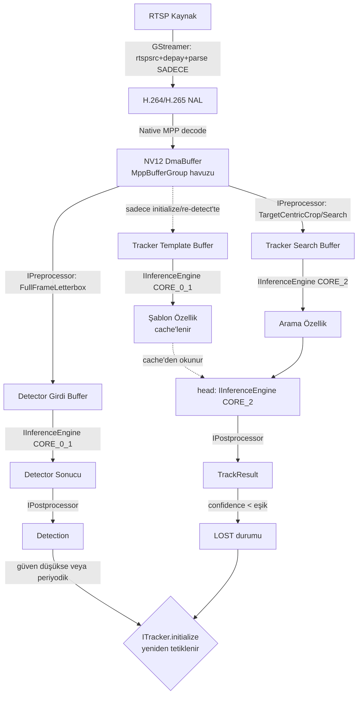

# Sistem Mimarisi — RK3588 Zero-Copy Tracking Pipeline

> Kod değildir. `01`–`05` numaralı arayüz sözleşmelerinin nasıl bir araya geldiğini, gerçek proje dizin yapısını ve ortak veri tiplerini tanımlayan kapsayıcı belgedir. Bu, projenin girişte okunması gereken belgesidir.

**Gerçek proje kökü:** `~/savx_npu_startup/tracking-app/`

---

## 1. Dizin Yapısı (Mevcut + Önerilen Genişletme)

```
tracking-app/
├── include/                          # Projenin PUBLIC arayüz sözleşmeleri
│   ├── core/
│   │   ├── IPreprocessor.hpp
│   │   ├── IInferenceEngine.hpp
│   │   ├── IPostprocessor.hpp
│   │   ├── IBufferPool.hpp
│   │   └── ITracker.hpp
│   ├── types/
│   │   ├── DmaBuffer.hpp             # §3 — ortak veri tipi
│   │   ├── ModelProfile.hpp          # §3
│   │   ├── Detection.hpp             # §3
│   │   ├── TrackResult.hpp           # §3
│   │   └── Transforms.hpp            # LetterboxTransform, CropTransform
│   └── config/
│       └── PipelineConfig.hpp        # build-time/runtime seçim şeması (§6)
│
├── src/
│   ├── preprocess/
│   │   └── RgaPreprocessor.cpp       # IPreprocessor impl (librga)
│   ├── inference/
│   │   └── RknnInferenceEngine.cpp   # IInferenceEngine impl (rknn_api.h)
│   ├── postprocess/
│   │   ├── YoloPostprocessor.cpp     # DetectorPostprocessor
│   │   └── SiameseHeadPostprocessor.cpp
│   ├── buffer/
│   │   └── DmaBufferPool.cpp         # IBufferPool impl (dma-heap)
│   ├── tracking/
│   │   └── SiameseTracker.cpp        # ITracker impl (NanoTrack/LightTrack)
│   ├── decode/
│   │   └── MppDecoder.cpp            # Native MPP decode (Rapor 1, Semi-Internal mod)
│   ├── pipeline/
│   │   └── PipelineOrchestrator.cpp  # Thread yönetimi, state machine köprüsü
│   └── main.cpp
│
├── lib/                              # Vendörlenmiş 3. parti (librga, mpp .so/.a)
│
├── librknn_api/                      # Rockchip resmi SDK — DOKUNULMAZ
│   ├── aarch64/librknnrt.so
│   └── include/{rknn_api.h, rknn_matmul_api.h}
│
└── models/                           # (önerilir, henüz yok)
    ├── detector_int8.rknn
    ├── tracker_template_backbone.rknn
    ├── tracker_search_backbone.rknn
    └── tracker_head.rknn
```

**Not:** `include/` ve `src/` ayrımı, `librknn_api/`'nin üçüncü-parti/dokunulmaz statüsünü netleştiriyor — kendi arayüzlerimiz asla Rockchip'in header'larını doğrudan dışa sızdırmaz (`RknnInferenceEngine.cpp` içinde `#include "rknn_api.h"` olur, ama `include/core/IInferenceEngine.hpp` bunu bilmez — saf soyutlama).

---

## 2. Modül → Arayüz Haritası

| Dizin/Dosya | Sözleşme | Referans |
|---|---|---|
| `src/preprocess/` | `IPreprocessor` | `01-IPreprocessor.md` |
| `src/inference/` | `IInferenceEngine` | `02-IInferenceEngine.md` |
| `src/postprocess/` | `IPostprocessor` | `03-IPostprocessor.md` |
| `src/buffer/` | `IBufferPool` | `04-IBufferPool.md` |
| `src/tracking/` | `ITracker` | `05-ITracker.md` |
| `src/decode/`, `src/pipeline/` | Bu belgede | §4, §5 |

---

## 3. Ortak Veri Tipleri (Kanonik Tanımlar)

Tüm arayüz belgeleri bu tiplere referans verir; tanımları burada tektir, tekrar edilmez.

### `DmaBuffer`
```
fd, virt_addr, size (=size_with_stride), w_stride, h_stride,
format (NV12/RGB888/...), dtype (UINT8/FP16), pool_origin
```
`shared_ptr<DmaBuffer>` olarak dolaşır, custom deleter ile havuza otomatik döner (bkz. `04-IBufferPool.md` §5).

### `ModelProfile`
```
precision (INT8 | FP16), w_stride, h_stride, size_with_stride,
zp, scale, target_width, target_height, n_dims, dims[],
pass_through (derive edilir, elle set edilmez), core_mask
```
`IInferenceEngine::queryProfile()`'ın çıktısıdır (bkz. `02-IInferenceEngine.md` §3-4).

### `LetterboxTransform` (detector için)
```
ratio (float), dw (int), dh (int)
```

### `CropTransform` (tracker için, her frame dinamik)
```
origin_x (int), origin_y (int), scale (float)
```

### `Detection` (detector çıktısı)
```
bbox {x, y, w, h}, class_id, confidence
```

### `TrackResult` (tracker çıktısı)
```
bbox {x, y, w, h}, confidence
```

---

## 4. Uçtan Uca Veri Akışı



---

## 5. Threading Modeli

| Thread | İçerik | Çekirdek/öncelik |
|---|---|---|
| **Ingestion** | GStreamer demux → MPP decode → `DecodeFramePool`'a yaz | CPU, gerçek zamanlı öncelik |
| **Preprocess** | Her frame için `SearchProfile` crop üretir (tracker için zorunlu); `is_target_lost` sinyali varsa ek olarak `FullFrameLetterbox` (detector için) üretir | CPU + RGA donanımı |
| **Tracker (kritik)** | `ITracker::track()` — **tek, seri, asla bölünmez** | NPU `RKNN_NPU_CORE_2` |
| **Detector (asenkron)** | `is_target_lost` sinyaliyle tetiklenir; başarılı olursa `ITracker::initialize()`'ı çağırır (bu da `template_backbone`'u aynı thread'de, ardışık olarak tetikler) | NPU `RKNN_NPU_CORE_0_1` |
| **Output** (opsiyonel, kapsam dışı detaylandırılmadı) | Sonuçları çizim/RTSP-out/telemetri olarak yayınlar | CPU |

Senkronizasyon: `is_target_lost` gibi durum bayrakları `std::atomic<bool>`; hedef konumu/şablon gibi paylaşılan veri `std::mutex` korumalı — Rapor 6'nın referans kod iskeletiyle birebir uyumlu.

---

## 6. NPU Çekirdek Tablosu (Nihai, Tüm Bulgular Birleştirilmiş)

| Rol | `rknn_core_mask` | Çalışma sıklığı | İzolasyon gerekçesi |
|---|---|---|---|
| `search_backbone` + `head` | `RKNN_NPU_CORE_2` | Her karede | Gecikmesi deterministik olmalı — asla paylaşılmaz |
| `detector` + `template_backbone` | `RKNN_NPU_CORE_0_1` | Olay-tetiklemeli, ardışık | İkisi asla eşzamanlı çalışmaz, kombine mod overhead'i tolere edilir |

`RKNN_NPU_CORE_AUTO` sistemde **hiçbir yerde** kullanılmaz (spinlock/kernel panic riski, bkz. `02-IInferenceEngine.md` §6).

---

## 7. Build-Time / Runtime Yapılandırılabilirlik

Bu, projenin en ilk isteğiydi ve tüm arayüz tasarımı buna hizmet edecek şekilde kuruldu:

- **Build-time (karta göre engine seçimi):** `IInferenceEngine`'in somut implementasyonu (`RknnInferenceEngine`) tek bir backend'e (`librknn_api`) bağlı görünüyor, ama arayüz (`include/core/IInferenceEngine.hpp`) donanımdan bağımsız. Farklı bir kart/NPU vendor'ı için ikinci bir `.cpp` implementasyonu (örn. `OtherVendorInferenceEngine.cpp`) aynı arayüzü karşılayarak build sistemine (CMake `option()`/`target_link_libraries` seçimiyle) eklenebilir. **`ITracker`, `IPreprocessor`, `IPostprocessor` hiçbir zaman `rknn_api.h`'ı doğrudan görmez** — bu ayrım build-time engine değişimini mümkün kılan temel.

- **Runtime (model değişimi):** `PipelineConfig`, model dosya yollarını (`detector_int8.rknn`, `tracker_*.rknn`) ve `PoolProfile` boyutlarını dışarıdan (JSON/YAML config ya da CLI argümanı — henüz belirlenmedi) okur. `ITracker::initialize()` çağrılmadan önce farklı bir `TrackerModelBundle` yüklenip yeniden `queryProfile()` çağrılabilir — bu, "Run ederken model değiştirme" gereksinimini karşılar. **Bu noktada henüz kararlaştırılmamış bir detay:** model değişimi sistemi durdurup yeniden mi başlatacak, yoksa çalışırken (hot-swap) mi yapılacak? Bu, ayrı bir tasarım kararı gerektirir, şu an açık.

---

## 8. İzleme / Tracking Katmanı (Başlangıç Motivasyonundan)

En baştaki istek — "çok iyi bir tracking interface" — şu metriklerin her `IPreprocessor`/`IInferenceEngine` çağrısında toplanmasını gerektirir:

- Her pipeline aşamasının süresi (decode, preprocess, inference, postprocess) — zaman damgası bazlı
- `IPreprocessor`'ın fast-path/slow-path kararı (bkz. `01-IPreprocessor.md` §6)
- Aktif NPU çekirdek yükü (`sudo cat /sys/kernel/debug/rknpu/load` ile harici doğrulanabilir, Rapor 1)
- `ITracker` state machine geçişleri (TRACKING↔LOST sayısı, ortalama LOST süresi)

Bu metrik toplama katmanı henüz ayrı bir arayüz olarak tanımlanmadı — gelecek bir tur için aday.

---

## 9. Henüz Netleşmemiş / Açık Kalan Sorular

Dürüstlük adına: bu 6 belge, 6 araştırma raporu + gerçek `rknn_api.h` + kullanıcı kararlarına dayanıyor, ama şunlar hâlâ varsayım veya kapsam dışı:

1. Detector→Tracker re-acquire eşleştirme mantığı (§6, `05-ITracker.md` §6'da varsayım olarak işaretli).
2. `TrackerModelBundle`'ın gerçek dosya sayısı (2 mi 3 mü) — dönüştürme scripti netleşince doğrulanmalı.
3. Model hot-swap mekanizması (§7, son paragraf).
4. Çıktı/görselleştirme/RTSP-out katmanı hiç detaylandırılmadı (kapsam dışı bırakıldı).
5. Metrik/tracking arayüzü (§8) henüz ayrı bir sözleşme değil.
